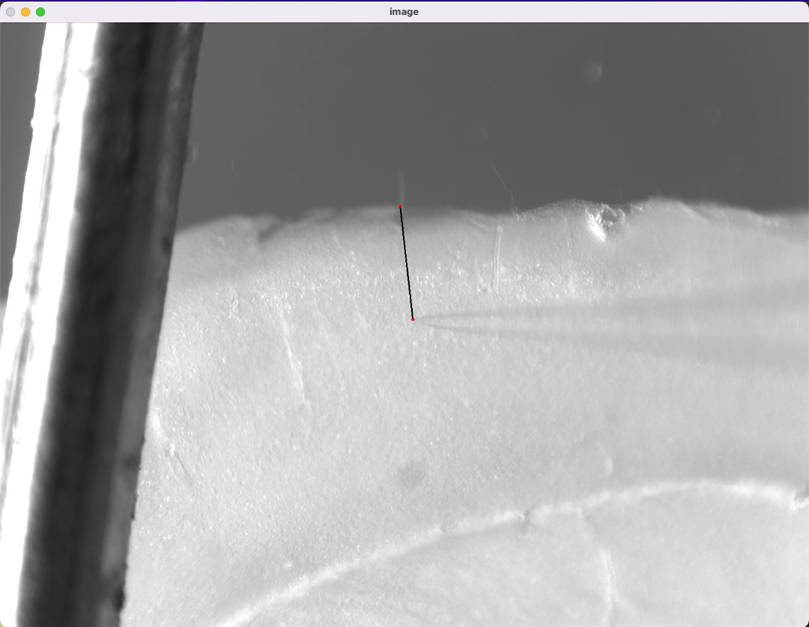
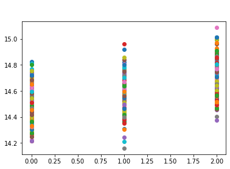
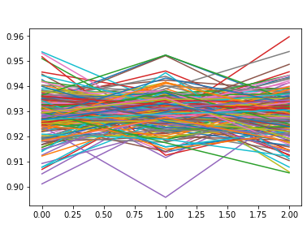
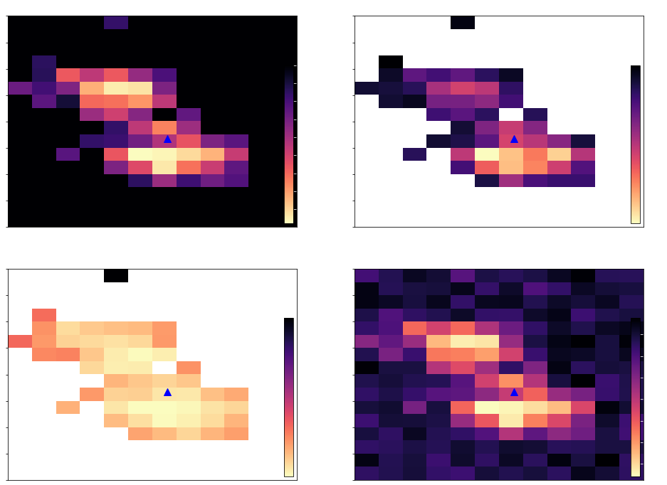
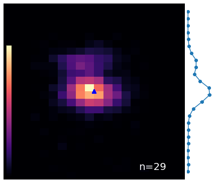
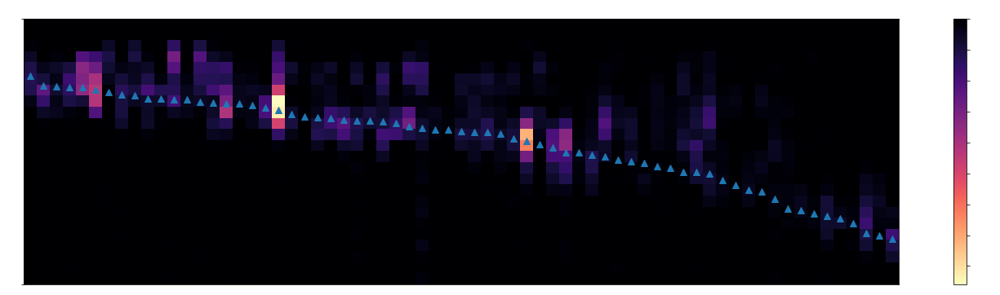
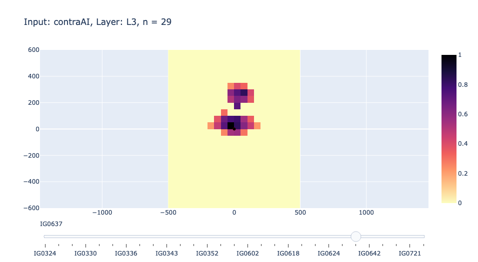

# sCRACM_analysis
# 
## Code package for extracting, cleaning, and visualizing electrophysiological data from optogenetic mapping experiements. Not 100% tested, under development.

## Getting started: 
 1. Clone/fork repo and install package.
 2. Update sCRACM.ini file database and ephys data paths in a text editor 
	a. path_database should be the full path to where your metadata file is stored 
	b. path_ephys_data should be the full path to the folder where your cleaned and analyzed data will be stored
	c. filename_cell_db should be the name of your metadata.csv file
 3. Ensure your metadata file contains proper column headers, reference test_database.csv provided in sample_data.

## Example 1: Extract, clean, and save data from single mapping experiment
Analyzing a single cell is quick and easy, and many cells can be processed quickly, after a long day of experiments. Run command: 
``` 
from sCRACM_analysis.analysis import cleanData
%matplotlib inline #for plotting in notebook
cleanData.analyzeSCRACMmap(numOfMaps,saveFlag=True)
```
anaylzeSCRACMMap takes 2 arguments, the number of maps you want to average, and an optional save flag (default = False). This command will open a file dialogue box for the user to select the XSG files that are to be averaged, as well as a .tif image taken during the experiment for soma depth and cortical thickness measurements. When the .tif image is opened measure soma depth of the cell, and cortical thickness of the slice for the column where the soma is present. Measurements are converted to microns and displayed after each click. To close the .tif image, press any key. 
Example: 

Map grid overlay:


The function will output summary information for the cell, as well as analysis plots for quality control. If the save flag is True, the user will be prompted to enter a filename for the analysis, and a .csv file with the processed data will be stored in the path_ephys_data directory. Name all files with the CellID_analysis.csv convention! 
**Important:** Once file is saved, open, and enter the measured values for soma depth and cortical thickness. If your mapping grid was aligned with stimulation points not covering the tissue, add a layer1Row value as well! 
Example output plots: 




## Example 2: Visualize processed data 
The analyzeData module contins multiple functions for screening cellular input maps, averaging maps based on catagorical groupings, and other useful plotting functions.
Map averaging: 



Collapse all maps of a group: 


Page through all maps of a group:


